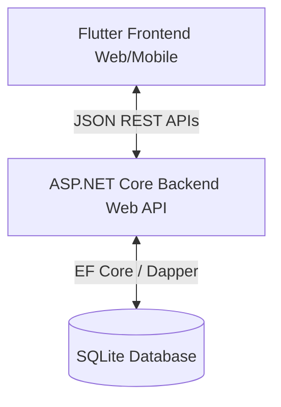

# Technical Documentation: Smart Attendance System

This document provides a clean, comprehensive technical overview of both the **ASP.NET Core Web API Backend** and the **Flutter Frontend** projects, outlining their architectures, key directories, business rules, API routing, and setup procedures.

---

## 1. System Architecture Overview

The Smart Attendance System is built as a decoupled Client-Server architecture:


- **Frontend**: Cross-platform client built using Flutter, styled with high-level modern glassmorphic designs, responsive sidebar navigation, and a local Speech-to-Text AI voice assistant.
- **Backend**: Lightweight, high-performance RESTful Web API built on .NET 9 using SQLite for storage, structured clean service-repository layers, and automated database seeding.

---

## 2. Backend Architecture (.NET 9 Web API)

The backend follows a structured Tiered/Repository pattern to decouple controllers from database operations.

### Project Directory Structure
```
smart_attendance_backend/
├── Controllers/         # REST API HTTP Endpoints (Routing & Request Validation)
├── Services/            # Business Logic & Orchestration
├── Repositories/        # Database Queries & Operations (Dapper / EF Core style)
├── Interfaces/          # Decoupling abstractions for Services and Repositories
├── Models/              # Plain Old CLR Objects (POCOs) & Data Transfer Objects (DTOs)
├── Data/                # Database Context & SQLite DB Initializer
├── Program.cs           # Web application bootstrap, dependency injection, and CORS
└── smart_attendance.db  # SQLite database file
```

### Core Business Logic Rules
1. **Late Login Check-In**:
   - Based on Shift Region assigned to the Employee:
     - **India / General**: Flagged as `Late` if check-in is after **12:00 PM**.
     - **UK**: Flagged as `Late` if check-in is after **4:00 PM**.
     - **US**: Flagged as `Late` if check-in is after **8:00 PM**.
2. **Leave Auto-Refund on Check-In**:
   - If an employee checks in on a day they have an active approved leave request, the backend automatically:
     - Cancels the leave request (status set to `"Cancelled"`).
     - Refunds the day back to their respective leave balance type (Sick, Casual, or Paid).
3. **Working Hours & Half-Day Downgrade**:
   - On checkout:
     - If the employee worked less than **8.5 hours** on a normal shift, their check-in status is automatically downgraded to `"Half Day"`.
     - For employees with an active approved `"Half Day Leave"`, they must work at least **4.5 hours**; otherwise, their status is set to `"Absent"`.
4. **Payroll Ledger Computations**:
   - Calculates monthly payrolls automatically.
   - Formula: `Working Days = Present Days + (Half Days * 0.5) + Approved Leave Days + Weekends`.
   - Any remaining days in the month are tagged as `Absent Days`.

### REST API Endpoints Map
| Endpoint | Method | Purpose |
|---|---|---|
| `/api/auth/login` | POST | Authenticate user & return employee profile |
| `/api/employees` | GET/POST | Query all employees / Add new employee (seeds leave balances) |
| `/api/employees/{id}` | PUT/DELETE | Modify employee profile / Deactivate account |
| `/api/attendance/history` | GET | Retrieve all check-in/checkout records |
| `/api/attendance/checkin` | POST | Log check-in (calculates late status & cancels leaves) |
| `/api/attendance/checkout` | POST | Log checkout (calculates working hours & shifts) |
| `/api/leaves/requests` | GET/POST | List leaves / Submit a new leave request |
| `/api/leaves/approve/{id}`| POST | Approve leave request (deducts from leave balance) |
| `/api/holidays` | GET/POST | Manage national holidays & weekend configurations |
| `/api/reports/payroll` | GET | Retrieve calculated monthly payroll list |
| `/api/dashboard/metrics` | GET | Pull real-time employee counts for widgets |

---

## 3. Frontend Architecture (Flutter)

The frontend is structured using Riverpod for declarative state management, GoRouter for URL-safe path routing, and high-fidelity custom UI components.

### Project Directory Structure
```
smart_attendance/
├── assets/                  # Local mock assets & config metadata
├── lib/
│   ├── core/
│   │   ├── constants/       # App Constants & Branding theme colors
│   │   ├── network/         # Dio HTTP Client configurations & request interceptors
│   │   └── theme/           # lightTheme and darkTheme configurations
│   ├── domain/              # Entity schemas & business interfaces
│   ├── features/            # Riverpod State controllers & logic by module
│   │   ├── auth/
│   │   ├── dashboard/
│   │   └── leave/
│   └── presentation/        # View Layer & UI layouts
│       ├── screens/         # Page modules (Dashboard, Payroll, Reports, etc.)
│       └── widgets/         # Reusable widgets (PremiumCard, Chatbot, etc.)
└── pubspec.yaml             # Flutter dependencies configuration
```

### Key UI Features
1. **Interactive Hover Cards (`PremiumCard`)**:
   - Implements translation animations (`Matrix4.translationValues(0, -4, 0)`) and custom border shadow halos when the user hovers their mouse over dashboard items, metrics widgets, or lists.
2. **AI Conversational Assistant (`AIChatbotWidget`)**:
   - Floating assistant widget mapped inside the global main shell.
   - **Real Voice Dictation**: Integrated HTML5 Web Speech API (`SpeechRecognition`) via Javascript Interop. Clicking the microphone starts real microphone transcription in Chrome.
   - **Natural Language Parsing (NLP)**: Local parser matches spoken or typed actions to execute app commands:
     - `"Apply sick leave for tomorrow..."` -> Auto-creates leave request and renders an interactive confirmed status card.
     - `"Show me reports..."` -> Triggers route navigation to the Reports screen.
     - `"Who is absent today?"` -> Reads local state provider cached metrics and prints names.

---

## 4. Setup and Installation

### Backend Setup
1. Verify .NET 9 SDK is installed on your computer.
2. Navigate to backend:
   ```bash
   cd smart_attendance_backend
   ```
3. Run the database seed and launch:
   ```bash
   dotnet run
   ```
   *The server starts listening on `http://localhost:5068` (configurable inside `Program.cs` / `appsettings.json`).*

### Frontend Setup
1. Verify Flutter SDK is installed.
2. Navigate to frontend:
   ```bash
   cd smart_attendance
   ```
3. Fetch dependencies:
   ```bash
   flutter pub get
   ```
4. Run locally:
   ```bash
   flutter run -d chrome --web-port=8080
   ```

---

## 5. Code Quality & Lint Compilation

Both codebases have been audited to ensure clean execution:
- **Backend**: Build succeeded with **0 warnings** and **0 errors**.
- **Frontend**: Clean analyzer results (**No issues found!**). All deprecated members (e.g. `withOpacity`, `activeColor`, and FormField `value` constraints) have been resolved.
